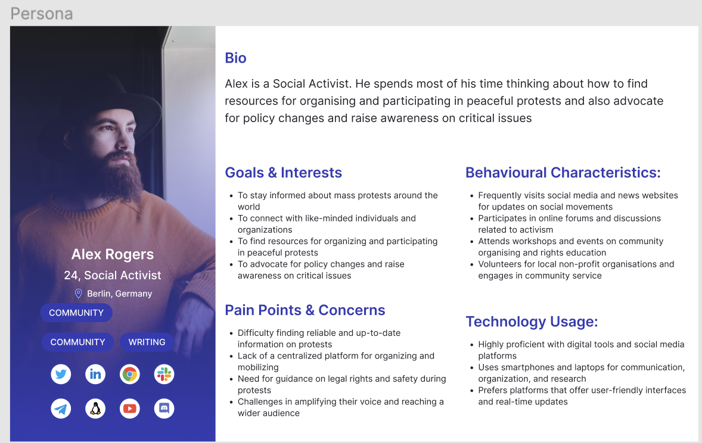
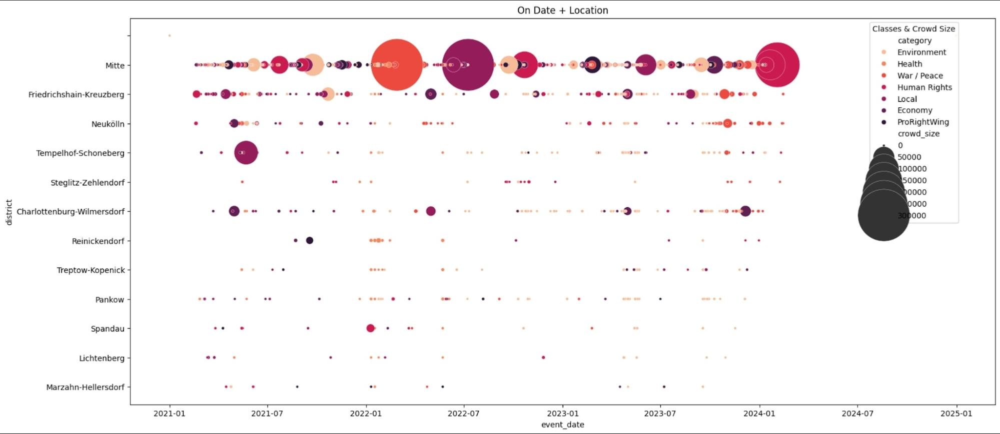

<h1 align="center">Find My Protest • Blog Post</h1>

  | <a href="#Introduction">Introduction</a>  |
  <a href="#User Experience">User Experience</a>  |
  <a href="Web Development">Web Development</a> |
  <a href="#Data Science">Data Science</a>  |
  <a href="#Deep Learning">Deep Learning</a>  |
  <a href="#Conclusion">Conclusion</a>  |
  <a href="#Contributors">Contributors</a>  |

---

## Introduction

Our journey began with a dataset on mass protests across countries, driven by our goal of creating a project with a social impact. After thorough research and finding a suitable dataset, we decided to develop a platform specifically for Berlin. This more realistic decision was based on the practicality of the data we had at our disposal.

During our initial brainstorming sessions, project members gathered insights and ideas on our target users while drawing inspiration from competitor websites. Additionally, we opted to rebrand our project as 'Find My Protest' to align more closely with the Berlin-centric nature of our data. These sessions were instrumental in guiding our direction. We meticulously documented our information gathering process using [Miro](https://miro.com/app/board/uXjVNuAQkqw=/), [Notion](https://www.notion.so/Links-Inspo-bf7c60a451d64b489c2715ee4da569e1) as well as the [FindMyProtest](https://drive.google.com/drive/folders/1Hrvnl6baYQ2TZEKw4ujPBzbtJYIEExWc) google drive we set up for our project. After agreeing on the tasks and content priorities for our platform as well as our general framework and workflow, each team could proceed with their respective tasks.

## User Experience

<h5 align="left">
  | &nbsp; <a href="#Mana">Mana</a> &nbsp; |
  &nbsp; <a href="#Weronika">Weronika</a> &nbsp; |
</h5>

[Figma](https://www.figma.com/file/5w82PrlM61kZCWFClhqVP5/MASS-PROTEST?type=design&node-id=0-1&mode=design)

### Mana

Firstly, Weronika and I chose two people living in Berlin and we interviewed them after that, we got a result(insights) from the interviews which showed us what our users needed. then both of us created personas and scenarios.

| Mana Persona                                                          | Weronika Persona                                                         |
| --------------------------------------------------------------------- | ------------------------------------------------------------------------ |
|  |  |

Secondly, I made a first draft of low wireframing to have an overall look at the mass protest website, and then, we checked it with the WD team to better grasp the overall look and the necessary options. So I have added the categories option for better accessibility for users to their relative and desired protests such as environment or finance section, etc. Moreover, I thought having a search area is a must, for the times that users already know which protest they want to attend but they don't know the exact location or time so, in this case, they can search the name of the protest and then the whole infos will pop up.

I wanted to specify each protest with its name dates, location, and a small description of each protest then I put a star next to the name of the protest that users by clicking on the stars can add to their favorite protest to attend. Of course, having an account is very important as users can add to their favorite protests to attend have a reminder, and create a username and password.

Thirdly, I made the high wireframing, User flow, and the fist logo finalized it.

### Weronika

In collaboration with Mana, we developed a user persona to guide our design process (refer to the image above). I designed and distributed a survey to collect feedback and insights from the user's perspective. Additionally, I created an initial draft of the logo, to which Mana added the finishing touch—a fist—to align it with the theme of mass protests. To the high fidelity prototype I added some nice images that depicts context and tells the story from images.

## Web Development

<h5 align="left">
  | &nbsp; <a href="#Frontend">Frontend</a> &nbsp; |
  &nbsp; <a href="#Backend">Backend</a> &nbsp; |
</h5>

In the beginning of the project we decided on what environment, frameworks and libraries to use. We came to the conclusion that it's best to use React and Bootstrap in the frontend and NodeJS, Express, MongoDB and Mongoose in the backend.

On the frontend we started the project looking into the logic of different functions we were thinking about having in our app while trying to figure out the structure of the components. After setting up Git we created our server and React app and started to code.

Our first challenge and success was to connect the backend server with the frontend application to display our data, after that the backend implemented the logic to render the search results in the components while the frontend started to build and design the page with the different components.

### Frontend

Initially, we explored rendering information using static templates like EJS, as it was the learned approach from the backend for integrating JS logic to render a view page. This approach came partly from uncertainty on how to link backend logic to React. However, after consulting with our WD mentor and reviewing examples, we realized that data could be fetched via an API using query parameters generated in the backend. Subsequently, we integrated the fetching logic into the main components and pages to be rendered

| ProtestPage                                                                | SearchBar                                                               |
| -------------------------------------------------------------------------- | ----------------------------------------------------------------------- |
|  |  |

We styled all components primarily using the Bootstrap library, with additional CSS for the fonts, banner sizing and logo placement. Dynamic sub-components were implemented using React hooks like useState and useEffect, ensuring that the protest card results from the query selectors or the search bar were simultaneously updated on the page. We also incorporated buttons to clear the search or load more results at the bottom using said hooks.

| Lower frame                                                             | Higher frame                                                            |
| ----------------------------------------------------------------------- | ----------------------------------------------------------------------- |
|  |  |

### Backend

On the backend, the initial task was to determine the metrics to provide to the frontend as query parameters. With the help of our DS mentor, the data science team and the backend identified a suitable data source, providing insight into the data structure and key-value pairs to be expected on the backend. We also decided to focus initially on implementing past protest data, with plans to incorporate future data once the data science team predicted the crowd size of upcoming protests.

The backend began by constructing mock data, sampling 150 past protests over a three-month period from the agreed source. This data was manually cleaned, its key-value pairs optimized, then converted to a JSON file for insertion.

MongoDB was chosen as the database, with a Mongoose schema created to define the protest object model and key types for easy searchability. Additionally, the backend included logic to seed protest images from [Unsplash](https://unsplash.com/s/photos/protests) for each protest.

Once the Protests collection was established and populated in the database, the backend constructed the API route `/protest` and its corresponding logic to query protest details for the frontend. The API route `/search` as well as its fetch logic was later added for the search bar. To ensure compatibility between search bar input types and the database, an input type validation was added on the backend.

Following the provision of final data for past protests by the data science team, which included a crowd size classification, the backend seamlessly integrated it into the database. Doing so, the key "crowd_size_name" was added to the Protest schema to enhance visualization of crowd size significance on the protest cards, as suggested by the WD mentor.

Later, the future data received underwent slight cleaning and restructuring by the backend to align with the format of previously inserted past protest data. The backend then decided to combine both past and future protests into a unified chronological collection within the database, using therefore a single Mongoose schema and model to handle both datasets.

In the protest schema, the backend introduced a boolean key labeled "isCrowdPredicted". This addition enabled the frontend to implement a logic for displaying crowd size predictions on future protest cards when the boolean value is set to "true."

To integrate future protest data, the database seed file was updated to incorporate insertion logic for the additional dataset. This ensured that both past and future protest JSON files, along with accompanying images, could be seamlessly inserted into the database.

Finally, the backend opted for an unconventional approach to address the challenge of fetching future protest data. Given that the future data provided by the data science team was in the form of mock data and not accessible via an API, sorting the data using conventional methods like "Date.now()" posed difficulties. As a solution, specific dates were set in the fetching logic of future protests from the database, utilizing query parameters such as "next month" and "next week" with ISO dates. This approach ensured that the frontend could accurately simulate future events despite the constraints posed by the nature of the data received.

In summary, this project offered valuable learning experiences for both frontend and backend, from data implementation to product visualization and usability, emphasizing to us the importance of effective teamwork and coordination in every stage of the development process.

## Data Science

### Data decision

The first month of the DS/DL tracks was about finding different data and testing it.
Of course we also found competitors during that research and great inspirations of visualizing Data.
We first had different international newspaper data but realized that it would not fit well together with the group. as we had already planned out Berlin specific tasks for WD & UX. When we decided on Berlin we had to look again at different sources.

- Luckily we found with the help of the group: Versammlungsbehörde Data that shows upcoming protests in Berlin on the Website. Different People/Organisations have collected the Data from Versammlungsbehörde:

  1. GitHub profile collects VBData per code every day in a JSONL file. ([Future Data](https://github.com/demodiff/berlin/tree/main/data%2Fjsonl))

  2. Zenodo collected one time through Frag den Staat Data from VB.

- Our second source we had found for international protests already. [ACLED](https://acleddata.com/early-warning/) Website collects Protest/Mob Violence/Riots for many countries from Newspapers. We could download 3 Years into the past with a free account and filtered it to Berlin.

After finding the Data we planned to work with multiple sources. We started cleaning them but realized during a Mentor session, that it will be easier for us and more clear in the matter of statistics to focus on one data source. In that meeting we also decided to use Google as our main interaction platform as we had used Colab. Sheets, Docs. .. already. After setting this up it was easy to interact or show each other or the Mentor, code or work on a sheet together.

After we decided for this specific Data (ACLED) we had to cut some of the DL's work we had planned on presenting (Visualization on a Map) We decided on one column for DL (the actual cut out from the article)
and one for DS (crowd\_ size).

### Cleaning

DS/ DL was still working closely together to clean the column for DL and define main categories & subcategories the next weeks. We manually defined them and later also the Name(column for WD). Later when DL track was successful we could switch our Subcategories to their prediction.

Next to it we started cleaning the rest of the Data. That included filtering out certain words from Crowd_column or changing it into the mean of two numbers that were given. We used fill NaN, Mean, replace(), split() and created our own Filters. We decided then to classify the crowd_size into 11 categories.

Paula later used indexing on (main)category & Subcategory and district. they were all converted in to_numeric(). The event_date column was converted into .datetime(), .year, .month, .day, .weekday, month+day, and back to string[:3](f.e. FEB).

We decided to cut out Mob Violence. Furthermore we included ProRightWing into the Analysation & Prediction but cut it out for the Website.

### Analysation

For the analysation part we used Matplotlib and Seaborn, it was fun to finally visualize our Data into Boxplots, Scatterplots and BarCharts. It was exciting to see how many layers you could add, with the hue, and different sizes of dots or other signs. Indexing the MainCategories and Subcategories helped to paint a better picture and show the connections.

The visualizations helped us to define the components/features that were important to predict the crowd_size later.

### Prediction

The first process to prepare the data was to Encode the string columns and date column in to_numeric().
We had two different approaches of Encoding: Irem took the road of Hot Encoding and Paula went with the before Indexed Version of Analysation.

#### Features

- Paula: took District, Month_Day and Subcategory as Features
- Irem: took Event_Date, Mood, District, Main_Category and Subcategory

We had first thought we would use MultiClass-Classification, but with a Mentor Session we decided to try different Methods like:
KNearest Neighbor, Linear Regression, Decision Tree and Random Forest. We played around a bit with Neighbours, Alpha, Regression, test_size, random_state and the Min_Max_Scaler.Results were mostly around 0.40 - 0.60.

We found that the manually Indexed Version with KNN Method,Min_Max_Scaler, One Neighbour and test_size(0.2) had accurate results and predictions.

When we tried on examples it actually showed the right results with: 0.94 train & 0.34 test. We validated the KNN Predictions and verified that One Neighbour will have the highest results. We did not have time to Evaluate and implement it into a column but will try implementing that as soon as possible.

## Deep Learning

As a deep learning team tasked with analyzing protest data in Berlin, I initially focused on the coordinates provided, hoping to map out future protest locations. Unfortunately, these coordinates only indicated the districts where protests were held, stopping my mapping ambitions.

Undeterred, I shifted my attention to predicting protest categories based on event descriptions. Collaborating with our data science team, we meticulously categorized these descriptions, a crucial step in our project. Employing a powerful NLP algorithm known as zero-shot classification, specifically Facebook's BART Large MNLI model, we made significant strides in accurately predicting protest categories.
However, we encountered a common hurdle: many event descriptions contained rich information, making it challenging for the algorithm to pinpoint a single category. Often, the correct category would rank second due to overlapping keywords with multiple target labels.

To evaluate our model's performance, we constructed a sample ground truth for comparison. Through iterative experimentation, leveraging Python libraries such as Pandas, NumPy, Transformers, and Scikit-learn, we continually refined our approach to increase accuracy, F1 score, and recall.
With each experiment, our metrics showed improvement, yet the model remained susceptible to change. To enhance accuracy further, we explored the possibility of utilizing even more granular sub-categories.

Our work produced important findings: there was a noteworthy rise in the number of climate change and conflict protests. This journey took place in the environments of Jupyter Notebook and Google Colab, highlighting the critical role that Python and its libraries play in our analytical activities.

## Conclusion

In conclusion, our project benefited from a comprehensive collaboration between UX, web development, deep learning, and data science teams. The UX team conducted insightful user interviews, developed personas, and created wireframes to ensure a user-friendly interface. Meanwhile, the Web Development team successfully implemented frontend and backend functionalities, overcoming challenges in data rendering and integration. The Data Science and Deep Learning teams collaborated to finalize the data selection before dividing into DL and DS. The Data Science team was able to successfully clean and analyze the data. Moreover, the DS team utilized KNearestNeighbor to generate logical predictions with accurate outcomes. The Deep Learning team employed advanced NLP algorithms to predict protest categories, enhancing our understanding of protest trends. Through iterative experimentation and refinement, we improved model accuracy and identified significant rises in climate change and conflict protests. Overall, this project highlighted to us the value of interdisciplinary teamwork in delivering a data-driven, visually engaging, and socially meaningful platform.

## Contributors

### Authors:

- DL: Tuğba Eraslanoğlu
- DS: Paula Hierzi, Irem Bayram
- UX: Mana Nosrati, Weronika Ajimati
- WD: Lydie Kouang (FE & BE), Annika Reynders (FE)

### Mentors:

- UX: Tatiana Olar
- WD: Aljoscha Beiers
- DS: Rafael Saraiva
